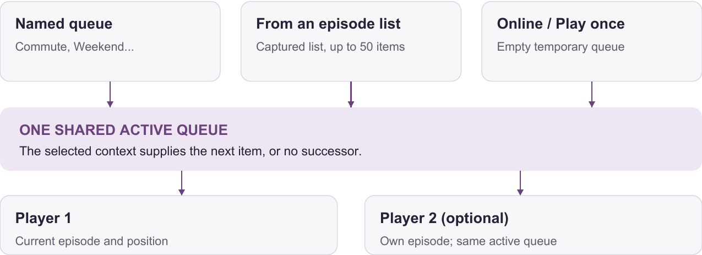
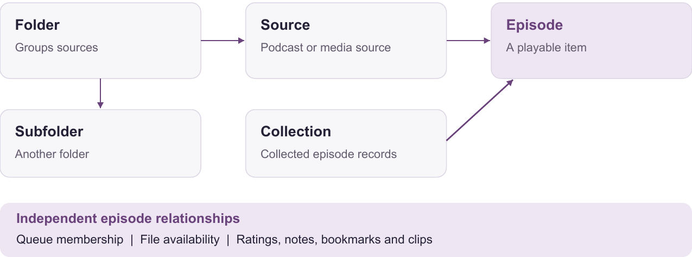
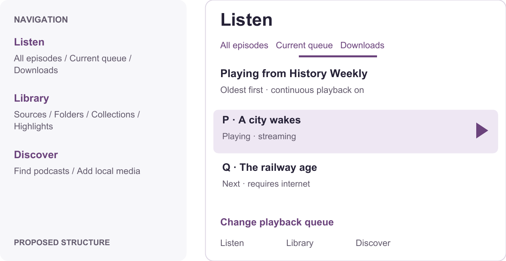
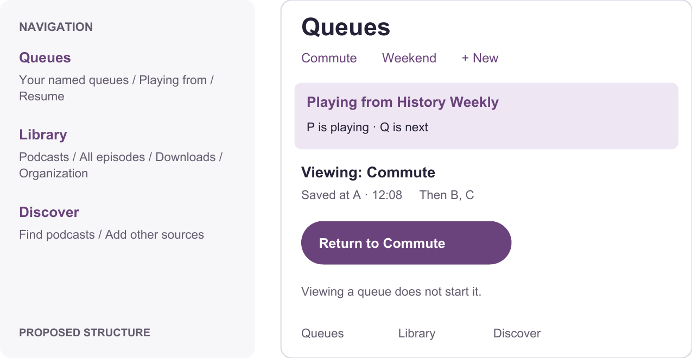
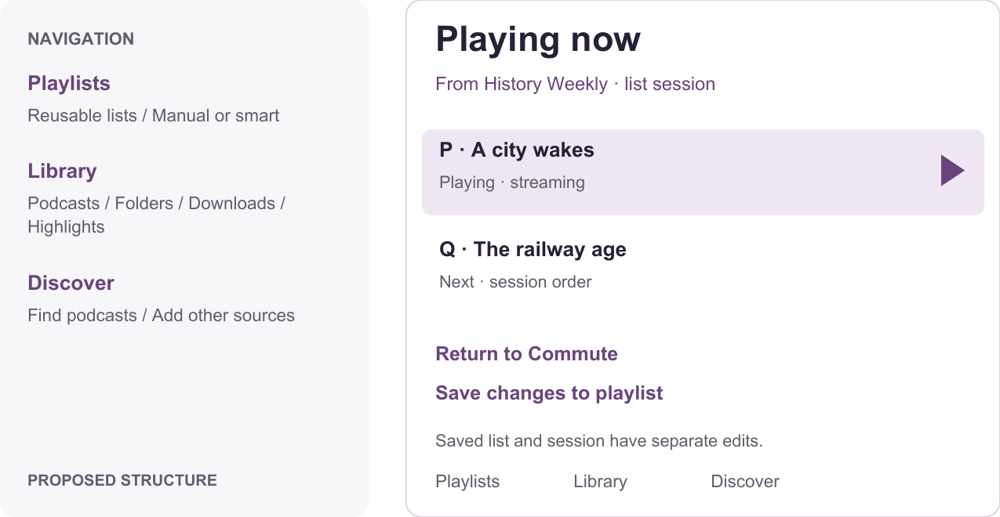

# Podcini.C

## 01 / Listening, without the guesswork

**Current concepts and three paths to a clearer experience**

### If I play an episode I have not downloaded, what happens next?

**It streams. What plays afterward depends primarily on where you pressed Play, not on whether the episode was downloaded.** The main episode-row Play button uses a local file when available and otherwise streams a remote episode. Download is a separate action. Streaming does not itself create a permanent offline download. [1, 2]

If you start from a **podcast already in your Library**, normal playback creates or reuses a list-based queue. On a newly created sequence, it starts at the episode you chose and includes up to 49 more episodes in the displayed order. With continuous playback enabled, the next item can stream too. That order can be newest first, oldest first, or another selected sort; it does not necessarily mean the podcast's next chronological episode. [3, 4]

If you start from an **online podcast preview before following it**, the app selects an empty temporary queue. Normal playback therefore stops after that episode. Remote episode search results behave similarly. Following a podcast and downloading an episode are different actions. [5]

If you start from a **custom queue**, that queue determines the sequence. Downloads and streams can coexist in it. Playback stops at its end unless repetition is enabled; turning off continuous playback stops automatic advancement sooner. [2, 6]

### Three independent questions

| Question | Concept | Example |
| --- | --- | --- |
| Where does this episode belong? | Library organization | A podcast, a folder of podcasts, or a collection |
| What will play next? | Playback order | My Commute queue or a sequence from a podcast list |
| Can I play it without a connection? | File availability | Downloaded, local file, or streaming required |

An episode can belong to a podcast, appear in more than one queue, have a downloaded file, and contain a bookmark at the same time. These are separate relationships, not competing destinations.

### Recommended direction

**Put custom queues first, podcasts second, and make the active playback source visible.** Keep the convenience of continuing through a list, but preserve the listener's named queues and make returning to them an explicit action.

Read the current behavior on pages 2-5, the sources of confusion on page 6, and the alternatives and recommended interaction rules on pages 7-12.

---

## 02 / The same Play button, different sequences

**Current behavior**

This table covers the main Play button. Playback options and some detail/history routes differ. A podcast means an existing Library source, unless marked preview. [1-6]

| Where you start | Playback source and next item | When it stops | Effect on a custom queue |
| --- | --- | --- | --- |
| Listen > Latest | A list-based queue, starting at the selected episode; may cross podcasts | End of the captured sequence, or continuous playback off | Switches the active context; does not clear the saved queue |
| A podcast's episode list | A list-based queue in that list's filter and sort order | End of captured sequence, or continuous playback off | Switches away from the custom queue |
| Listen > Downloads | A list-based queue of episodes returned by the Downloads view | End of captured sequence, or continuous playback off | Switches away from the custom queue |
| Listen > Up next | The queue selected in this view; the following queue entry is next | End unless Repeat queue is on; also stops if continuous playback is off | Uses the selected queue |
| Manage queues > a named queue | Playing an item activates that queue | Same continuous/repeat rules | Saved order supplies the sequence |
| Online podcast preview / remote episode results | Empty temporary queue; no automatic successor | After this episode | Replaces the active context without clearing saved queues |
| Explicit Play once / Stream once | Empty temporary queue | After this episode | Replaces the active context without clearing saved queues |

### Example: a non-downloaded episode

Your Commute queue contains **A, B, C**. While A is playing, you open a followed podcast ordered **newest first** and play episode **P**. P streams; the podcast list becomes the active playback context. When P ends, the next entry in that captured list can stream, even if B was previously your next planned episode. Merely switching contexts does not erase Commute. [1-4]

Play P from an online preview instead, and normal playback has no next item. This is a meaningful behavior difference behind very similar controls. [5]

### Exceptions worth knowing

- A one-item queue does not loop through itself merely because Repeat queue is enabled. Repeating one episode is a separate playback option. [2]
- The queue-advancement path does not independently filter out played episodes. The list or queue you supplied determines its contents. [2, 4]
- Details, Highlights, and alternate playback actions do not all rebuild a sequence from the list you are viewing. A still-active queue can therefore influence what happens afterward. [1, 10]

---

## 03 / How the current playback model fits together

**Current behavior**

### A list-derived queue is a snapshot

The app has one persisted special queue, labeled **From your episode list**. A new capture replaces its entries with at most 50 episodes, including the selected episode. It enables continuous playback and copies the list's order. It does not automatically extend to the entire podcast catalogue. [4, 12]

When the list identity matches and the selected episode is already present, the app reuses the existing sequence. Latest and Downloads use fixed identities, so changing their filter or sort need not rebuild playback order on the next tap. Podcast lists include filter/sort information in their identity, so those changes can trigger a fresh capture. A later capture does not reset the special queue's Repeat queue setting. [3, 4]

### Continuous playback, Next, and Repeat are distinct

**Continuous playback** permits automatic advancement. **Next** is a manual advance and can move forward even when continuous playback is off. **Repeat queue** allows wrapping from the final entry back to the start of a multi-item queue. New queues default to continuous playback on and repetition off. [2, 6]

The full player's Up next preview is calculated from queue entries and repetition, but does not check continuous playback. It can name an episode that the app will not automatically start. If the current episode is absent from a newly selected queue, the ordinary advancement path selects that queue's first item. [2, 7]

### Network changes and two players

Starting a normal stream can ask for permission on a restricted connection. Automatic advancement checks for a remote URL and connectivity, but does not repeat that same restricted-network permission check. If the next item needs a stream and no connection is available, this path does not scan ahead for a later downloaded episode. [1, 2]

Two players have separate current episodes, but use a **shared active queue**. Changing that queue can affect both players' subsequent advancement; two independent playback sessions cannot be assumed. [2, 7]

---

## 04 / Library concepts in plain language

**Current behavior**

| Term in the app | What it means | What it does not imply |
| --- | --- | --- |
| Listen | A hub for episode browsing, the selected queue, and downloads | One consistent playback list |
| Latest | Library episode results, newest first by default; filters and sorting can change them | Only new or unplayed episodes |
| Up next | In Listen, the full selected queue; in the player, a successor preview | Every displayed episode will automatically play |
| Source | A podcast/feed, local-media source, or external-provider source | A downloaded podcast |
| Folder | A hierarchy containing sources and other folders; internally called a volume | A playlist of individual episodes |
| Collection | A synthetic feed containing collected episode records | A named playback queue or just a tag |
| Highlights | Episodes rated Good/Super or containing notes, bookmarks, or clips | A download list or a universal Save switch |
| Downloads | A view of episodes with a recorded file URL, including applicable local files | An independent permanent queue |
| Queue history | Episodes removed from a particular queue | Listening history, which tracks listening activity |

**Example:** put your astronomy and history podcasts in a Learning folder, copy useful episodes into a Space collection, and add selected episodes to a Weekend queue. Downloading those episodes makes their files available offline; a bookmark makes them discoverable in Highlights. [3, 6, 8-10]

The tabs Sources, Folders, Collections, and Highlights expose different views and relationships. They are not four interchangeable containers.

---

## 05 / Organizing, saving, and automating

**Current behavior**

### Similar actions change different things

| Action | Actual consequence |
| --- | --- |
| Follow a podcast | Adds its source and episode metadata to Library. Downloading files is separate. |
| Add to a named queue | Adds a playback-order reference; it does not, by itself, guarantee an offline file. |
| Play next | Inserts or moves the episode after Player 1's current item in the active queue; if absent, inserts at the front. |
| Download | Saves a media file when the source supports downloads. It does not define the next episode. |
| Rate Good/Super; add a note, bookmark, or clip | Makes the episode eligible for Highlights. |
| Put a source in a folder | Changes its organizational parent; ordinary folder grouping does not create a playback sequence. |
| Add an episode to a collection | Can create a separate episode record rather than a second reference to one shared record. |

### Collections are more than saved playlists

The shelving operation normally copies an episode record into a synthetic feed. Copying from an ordinary podcast gives the copy a new identity and preserves original-source metadata. A move between eligible synthetic feeds can instead reassign the existing record. Do not assume that ratings, progress, and annotations are a single shared record across every collection copy. [9]

### Folder removal is consequential

Removing a folder recursively removes its contained sources and subfolders. For each source, the app can preserve valued episodes in an archived source and remove the others. Retention considers ratings, notes, bookmarks, clips, and selected listening states. This is not simply dissolving a folder and leaving everything at the Library root. [8, 9]

### Automation needs a destination and a policy

A source's **default queue** identifies where associated-queue actions and automatic enqueueing send episodes. It does not promise that pressing Play in the source's list will use that named queue. Automatic enqueueing and automatic downloading are separately enabled and have their own selection policies and limits. [3, 6, 11]

Queue ordering can also depend on insertion position, automatic sorting, and a lock that prevents manual reordering. Empty named queues can trigger refilling from eligible associated sources. Completion and deletion preferences can remove played episodes from multiple queues, so preserved queue membership is not absolute under every automation setting. [2, 4, 6]

**Useful distinction:** “Add new episodes to Commute” controls listening order. “Download episodes for offline listening” controls availability. A clear interface should show both policies separately.

---

## 06 / Where understanding breaks down

**Current experience and its consequences**

| Problem | What the listener encounters | Design requirement |
| --- | --- | --- |
| One hub mixes three concepts | Latest, Up next, and Downloads look like equivalent playback modes | Distinguish catalogue, sequence, and file availability |
| Play changes context indirectly | A podcast tap replaces the active queue with a list-derived sequence | Name the playback source and provide Return to queue |
| Queue selection changes playback state | Choosing a queue under Up next affects future advancement | Separate viewing a queue from activating it |
| The next-item preview overpromises | An episode is shown even when continuous playback is off | Say “Stops after this episode” when that is the effective rule |
| The visible list and sequence can diverge | Reused snapshots retain older ordering/filter results | Make sequence capture and subsequent changes predictable |
| Queue tools are split | Everyday listening and queue management require different routes | Put create, select, reorder, and add actions together |
| Library categories have unequal meaning | A collection can look like a folder or queue, despite different data behavior | Explain what each container contains and changes |
| Power settings have invisible consequences | Removal, repetition, sorting, network policy, and two players interact | Show the effective outcome near playback |

### Labels alone cannot resolve the main issue

Renaming Virtual to From your episode list helps, but it still does not identify **which** list, which order was captured, or why a saved queue stopped supplying the next item. Likewise, Sources is broad enough for mixed media but less recognizable than Podcasts for ordinary podcast browsing.

The most valuable sentence the app could display is specific: **“Playing from History Weekly · oldest first. Next: The railway age.”** A second sentence can make the stopping rule explicit: **“Stops at the end of this list.”** These are proposed explanations, not current guarantees.

### Why older explanations can mislead

The README says every queue is circular and describes an older mixture of associated-queue and natural-feed rules. The current implementation has a Repeat queue setting, defaulting off, and the main list routes create list-derived queues. The redesigned documentation and interface should use the same vocabulary and rules. [2-6, 14]

### Keep the useful depth

Named queues, folder organization, offline listening, collections, annotations, local media, external sources, and advanced automation are valuable capabilities. The opportunity is to make their boundaries understandable and their effects visible, rather than expose every setting at the same level.

---

## 07 / Option A: clarify the existing model

**Proposal - retain behavior, explain it better**

Keep Listen, Library, and Discover. Rename Latest to All episodes and Up next to Current queue in the browsing hub. Preserve the term Up next for the actual upcoming sequence in the player. Keep named queues and the special list-derived queue, but display the originating list and stopping rule.

### The same listening journey

You are listening to **Commute: A, B, C**. You open **History Weekly**, ordered oldest first, and play **P**. The existing list-derived mechanism takes over. A status line says “Playing from History Weekly”; the player names **Q** as the next episode and exposes the continuous-playback setting. Commute remains reachable through the queue picker, whose label makes activation explicit.

### What improves

- Everyday labels explain the difference between episodes, the selected queue, and offline files.
- “Continuous playback off - stops after this episode” removes the misleading next-item promise.
- Source settings explain their target: “Automatically add new episodes to Commute.”

### What remains difficult

The selected queue still doubles as playback state. The 50-item snapshot and its reuse rules remain. Collections still have separate-record semantics. Better copy must explain these behaviors repeatedly, and switching back to a queue remains less predictable than restoring a saved session.

**Implementation impact: low to moderate.** Mostly navigation labels, context summaries, effective-state previews, and help text; no required data-model migration. Naming the originating list requires retaining a human-readable source label.

---

## 08 / Option B: custom queues first

**Recommended proposal - make listening order the main workspace**

Use **Queues · Library · Discover** as primary destinations. Queues opens the last viewed custom queue, with the currently playing source clearly identified. Library opens Podcasts and offers All episodes, Downloads, Folders, Collections, Highlights, and other source types as explicit routes. Keep the existing visual character and native Android navigation patterns. [13]

### The same listening journey

You are listening to **Commute: A, B, C**. You open **History Weekly**, oldest first, and play **P**. A named list session starts at P and continues to **Q**. Commute retains its ordered membership and saved position. The player says “Playing from History Weekly” and offers **Return to Commute**. Viewing Weekend does not change playback. Returning to Commute resumes A at its saved position; B remains next.

### Why this fits

Custom queues are first-class objects you can create, inspect, reorder, and resume. A podcast list is still convenient to play directly, but the app distinguishes **the queue you are viewing** from **the sequence you are hearing**.

Place automatic-add rules and offline readiness on each queue's detail screen. Keep advanced source settings available, while summarizing their practical result: “New History Weekly episodes go to Commute.”

**Implementation impact: moderate to high.** Introduce explicit playback-session context and per-queue resume state; separate selected/viewed queue state from active playback state; reuse existing queue records and membership. Keep collections as they are for this redesign. No queue or annotation data should be discarded.

---

## 09 / Option B: a precise interaction contract

**Proposed behavior**

| Action | Result |
| --- | --- |
| Play in a custom queue | Activate that queue at the chosen episode; use its saved order and continuation settings. |
| Play in a podcast or other episode list | Start a named session from that item in the currently displayed order. Keep saved custom queues and their resume points. Apply this consistently to online previews too. |
| Play next | Insert the episode immediately after the current item in the active player's session. If already scheduled later there, move that occurrence. Name the affected session in feedback. |
| Add to queue | Choose a named custom queue and append by default. Do not start playback or replace the active session. If auto-sort applies, show that ordering rule before confirming. |
| Play only this episode | Start a one-item session and stop afterward; keep the previous context available through Return to queue. |
| Return to queue | Restore the last custom queue session at its saved episode and position. Do not automatically return merely because the temporary list ended. |
| Open another queue | Browse or edit it without changing what is playing. A separate Play/Resume action activates it. |

### Predictable ordering and stopping

Capture the list's displayed membership and order at Play time. Subsequent filtering, sorting, and refreshes affect browsing, not an already running session. Show **Restart from this view** to intentionally replace it. Support the full captured list, loading entries as necessary; remove the hidden 50-item behavioral ceiling.

Show the current item separately from upcoming items. Continuous playback defaults on for new sequences; repetition defaults off. When continuous playback is off, show **Stops after this episode**, while retaining manual Next. At the final item, stop unless repetition is explicitly enabled. Existing custom-queue settings survive migration.

### Keep saved queues dependable

Switching sessions does not remove entries. Completing an episode elsewhere must not silently remove it from every custom queue. Offer an explicit per-queue rule, **Remove completed episodes**, and apply it when playback completes in that queue. Map existing global removal behavior into an explained migration choice instead of silently changing it.

### Network and player boundaries

Apply the same streaming policy to a direct Play and automatic advancement. If the next item cannot play offline, pause with **Download required / Connect to continue** and offer **Skip unavailable**; do not silently reorder the queue. A one-time mobile-data allowance applies to the chosen episode; continuing to another stream requires the effective policy to allow it.

When two players are enabled, each owns its playback context. Queue and Play next actions identify the target player. Use one player by default. Next-item previews, media controls, and the in-app queue must agree for that player.

---

## 10 / Option C: unify episode lists

**Proposal - simplify the underlying episode-list concepts**

Unify custom queues and curated collections as **Playlists**. Separate reusable saved lists from **Playing now**, the active session. Library still contains podcasts and other sources; folders still group sources. Highlights and downloads remain independent episode properties and views.

### The same listening journey

You start the **Commute playlist: A, B, C**. Playing **P** from History Weekly creates a new Playing now session, with Q following it. Commute remains a reusable saved playlist with a resume point. Return to Commute restores that context. Editing Playing now affects the session; **Save changes to playlist** explicitly updates the saved list.

### What becomes simpler

There is one user-facing concept for a curated list of episodes. Playlists reference shared episodes; adding the same episode to two playlists does not create independent copies of its listening progress or annotations. Smart playlists can express automatic selection rules, while manual playlists preserve chosen order.

### What becomes more demanding

Saved-list edits and session edits now have different lifetimes. The interface must make clear whether an action changes just this listening session or the reusable playlist. Existing collections may contain separate episode records, so migration cannot safely collapse them merely because titles or URLs look similar.

Preserve original-source information, notes, bookmarks, clips, progress, and existing automation. Link clearly identical records only through a reversible mapping; retain distinct records when their identity or annotations conflict. Imports, exports, synchronization, and two-player contexts need corresponding compatibility work.

**Implementation impact: high.** A new shared-membership model, session model, migration tools, and compatibility handling are necessary. This is a longer-term product direction, not a prerequisite for making custom queues understandable now.

---

## 11 / Choosing a direction and a vocabulary

**Recommendation: option B**

Option B directly supports the priority of custom queues while preserving convenient podcast listening. It addresses the hidden state changes that terminology alone cannot solve, without requiring the collection migration of option C.

| Dimension | A: clearer labels | B: queues first | C: unified playlists |
| --- | --- | --- | --- |
| Custom-queue access | Still nested | Primary destination | Primary saved playlists |
| Predictability | Better explanations; current rules remain | Explicit playback context and restoration | Explicit context, plus saved/session distinction |
| Library organization | Existing categories explained | Podcast-first entry; existing containers retained | Fewer episode-container types |
| Advanced controls | Preserved, still distributed | Grouped by queue/source/player | Re-expressed as playlist/session rules |
| Compatibility work | Limited | Session and removal-policy migration | Substantial collection and identity migration |
| Main compromise | Complexity remains | Requires playback-state restructuring | Largest change and migration risk |

### Proposed English and French labels

Use concrete names in playback status; reserve “source” for a broad source-type category or technical settings. Custom queue names remain the listener's own text.

| English | Français |
| --- | --- |
| Queues | Files d'attente |
| Podcasts / Folders / Collections | Podcasts / Dossiers / Collections |
| Up next | À suivre |
| Playing from: Commute | Lecture depuis : Trajet |
| Play next | Lire ensuite |
| Add to queue | Ajouter à une file d'attente |
| Play only this episode | Lire uniquement cet épisode |
| Return to queue | Reprendre la file d'attente |
| Stops after this episode | Arrêt après cet épisode |
| Downloaded / Requires internet | Téléchargé / Connexion Internet requise |

These labels describe the proposed interface. Today, Listen is Écouter, Sources is Sources, and Highlights is Favoris et notes. Keep plurals, arguments, accessibility labels, and notifications aligned across both languages. [12]

---

## 12 / What a successful redesign makes possible

**Acceptance journeys for option B**

- **Build a commute:** create a named queue, add episodes from two podcasts, reorder them, and identify the next episode without opening advanced settings.
- **Explore without losing a plan:** start from a podcast list, see its named sequence, browse another queue without affecting playback, and return to the original queue at its saved position.
- **Predict stopping:** distinguish continuous playback off, end of list, repeat queue, and Play only this episode before the current episode finishes.
- **Listen offline:** see which upcoming items require internet; apply the same data policy to direct starts and automatic advancement; recover without silent skipping.
- **Organize safely:** distinguish a folder from a collection and a queue; understand removal consequences before confirming; retain notes and bookmarks.
- **Use either language or player:** English and French convey the same result; large text and accessibility actions remain usable; two players keep separate next-item contexts.

### Source references

References identify the relevant implementation and product guidance. Kotlin paths below share the prefix `app/src/main/kotlin/ac/mdiq/podcini/`.

1. [ArchiveUi.kt:148](/Users/camille/Dev/Personal/Podcini.C/app/src/main/kotlin/ac/mdiq/podcini/ui/compose/ArchiveUi.kt:148) - main Play and Play next; [ActionButton.kt:113](/Users/camille/Dev/Personal/Podcini.C/app/src/main/kotlin/ac/mdiq/podcini/ui/actions/ActionButton.kt:113) - streaming permission, single-item and alternate actions.
2. [MediaPlayerBase.kt:619](/Users/camille/Dev/Personal/Podcini.C/app/src/main/kotlin/ac/mdiq/podcini/playback/MediaPlayerBase.kt:619) - advancement, streaming checks, completion and removal; `skip` at 729; `isStreamingCapable` at 1041.
3. [ListenScreen.kt:63](/Users/camille/Dev/Personal/Podcini.C/app/src/main/kotlin/ac/mdiq/podcini/ui/screens/ListenScreen.kt:63) - lists and active-queue picker; [FeedDetailsScreen.kt:693](/Users/camille/Dev/Personal/Podcini.C/app/src/main/kotlin/ac/mdiq/podcini/ui/screens/FeedDetailsScreen.kt:693) - list playback callback.
4. [Queues.kt:31](/Users/camille/Dev/Personal/Podcini.C/app/src/main/kotlin/ac/mdiq/podcini/storage/database/Queues.kt:31) - 50-item limit; `addToQueue` at 125; `queueToVirtual` at 170.
5. [OnlineFeedScreen.kt:590](/Users/camille/Dev/Personal/Podcini.C/app/src/main/kotlin/ac/mdiq/podcini/ui/screens/OnlineFeedScreen.kt:590) and [SearchScreen.kt:492](/Users/camille/Dev/Personal/Podcini.C/app/src/main/kotlin/ac/mdiq/podcini/ui/screens/SearchScreen.kt:492) - empty temporary queue for remote playback.
6. [PlayQueue.kt:30](/Users/camille/Dev/Personal/Podcini.C/app/src/main/kotlin/ac/mdiq/podcini/storage/model/PlayQueue.kt:30) and [QueuesScreen.kt:573](/Users/camille/Dev/Personal/Podcini.C/app/src/main/kotlin/ac/mdiq/podcini/ui/screens/QueuesScreen.kt:573) - defaults, refill, continuous playback, repeat, and ordering.
7. [ArchivePlayer.kt:248](/Users/camille/Dev/Personal/Podcini.C/app/src/main/kotlin/ac/mdiq/podcini/ui/compose/ArchivePlayer.kt:248) and [Theatres.kt:37](/Users/camille/Dev/Personal/Podcini.C/app/src/main/kotlin/ac/mdiq/podcini/playback/Theatres.kt:37) - preview and shared active queue.
8. [LibraryScreen.kt:721](/Users/camille/Dev/Personal/Podcini.C/app/src/main/kotlin/ac/mdiq/podcini/ui/screens/LibraryScreen.kt:721) and [Volume.kt:170](/Users/camille/Dev/Personal/Podcini.C/app/src/main/kotlin/ac/mdiq/podcini/storage/model/Volume.kt:170) - library categories and recursive folder removal.
9. [Feeds.kt:149](/Users/camille/Dev/Personal/Podcini.C/app/src/main/kotlin/ac/mdiq/podcini/storage/database/Feeds.kt:149) - source deletion and collection copying; [Feed.kt:425](/Users/camille/Dev/Personal/Podcini.C/app/src/main/kotlin/ac/mdiq/podcini/storage/model/Feed.kt:425) - retention criteria.
10. [SavedLibraryScreen.kt:27](/Users/camille/Dev/Personal/Podcini.C/app/src/main/kotlin/ac/mdiq/podcini/ui/screens/SavedLibraryScreen.kt:27) - Highlights eligibility and playback route.
11. [Feed.kt:291](/Users/camille/Dev/Personal/Podcini.C/app/src/main/kotlin/ac/mdiq/podcini/storage/model/Feed.kt:291) - associated queue and separate automation flags.
12. [English interface labels](/Users/camille/Dev/Personal/Podcini.C/app/src/main/res/values/archive_strings.xml) and [French interface labels](/Users/camille/Dev/Personal/Podcini.C/app/src/main/res/values-fr/archive_strings.xml); `values/ui_strings.xml` - built-in queue labels.
13. [Android: layouts and navigation patterns](https://developer.android.com/design/ui/mobile/guides/layout-and-content/layout-and-nav-patterns) - native navigation structure.
14. [README: Queues](/Users/camille/Dev/Personal/Podcini.C/README.md:185) - historical queue descriptions discussed on page 6.
